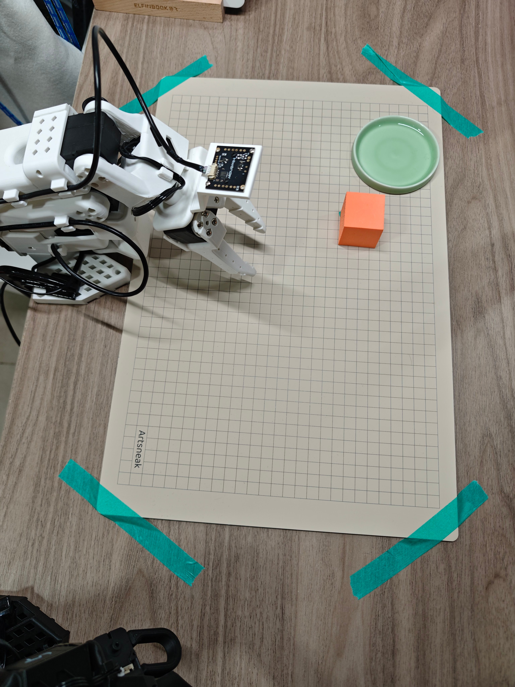
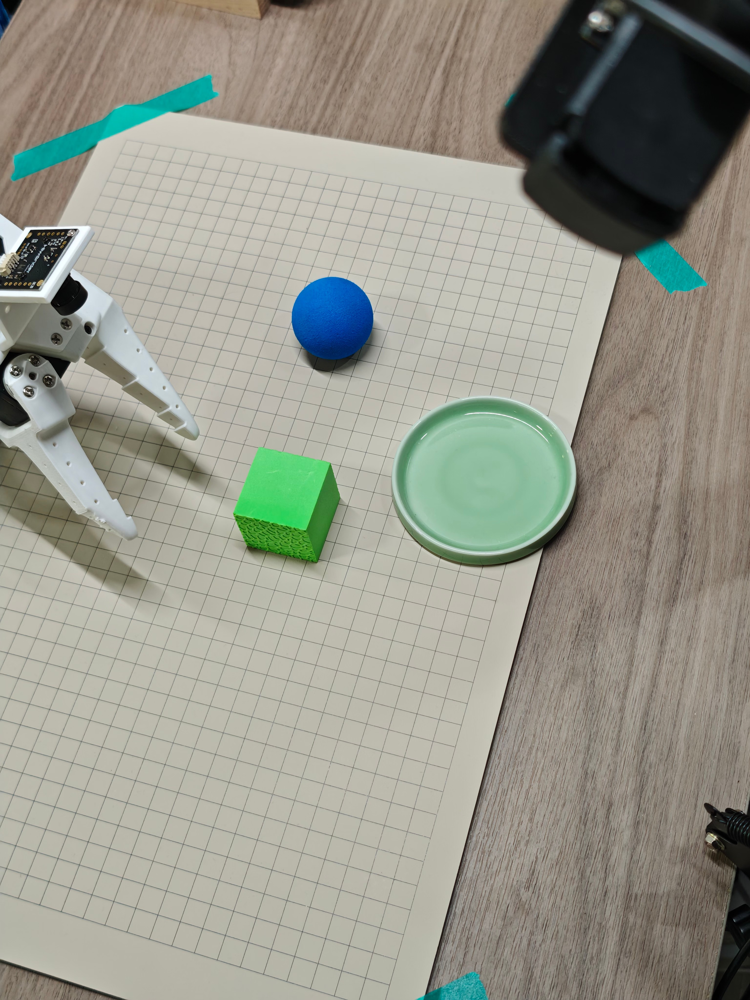
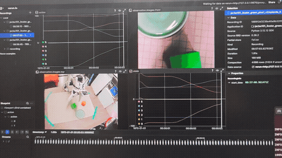
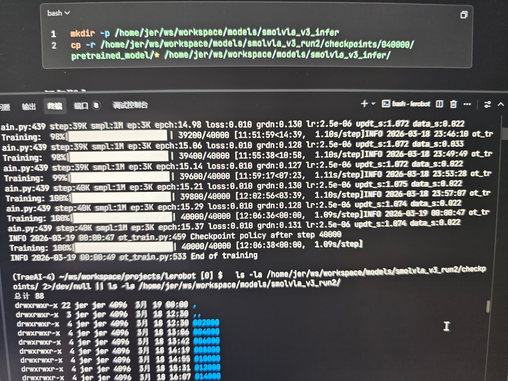
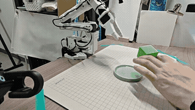

# SO101 机器人学习项目

> **一句话概括**：从零开始，用幻尔（Huaner）SO101 双臂机械臂 + LeRobot 框架 + SmolVLA 算法，让机器人学会在随机位置抓取小方块并放入小盘子中。
>
> 这是一个从装系统、刷 BIOS、装驱动，到遥操作录制数据、训练模型、推理部署的完整实机项目。所有文档基于实际操作经历撰写，重点记录了过程中遇到的各种坑和解决方案。
>
> 硬件：NVIDIA RTX 5070 12GB | AMD Ryzen 7 3700X | B450M 主板 | 96GB DDR4 | Ubuntu 22.04 移动固态硬盘

---

## 目录结构

```
myso101/
├── README.md                  ← 本文件
├── 踩坑记录/                   ← 项目全过程踩坑记录（按章节拆分）
│   ├── pitfalls.md            ←   索引
│   ├── 01-ubuntu-system.md    ←   1. Ubuntu 系统环境搭建
│   ├── 02-network.md          ←   2. 网络相关问题
│   ├── 03-nvidia-driver.md    ←   3. NVIDIA 驱动与 CUDA（含 BIOS 更新）
│   ├── 04-lerobot-env.md      ←   4. LeRobot 环境安装
│   ├── 05-so101-hardware.md   ←   5. SO101 机械臂硬件
│   ├── 06-camera.md           ←   6. 摄像头配置
│   ├── 07-source-modifications.md ← 7. LeRobot 源码修改（4处）
│   ├── 08-data-recording.md   ←   8. 数据录制（含录制迭代 v1→v6）
│   ├── 09-model-training.md   ←   9. 模型训练（3轮）
│   ├── 10-model-inference.md  ←   10. 模型推理（V1/V2 + V3）
│   └── 11-appendix.md         ←   附录（命令、路径、参数、硬件、训练产出）
└── 项目流程/                   ← 完整项目流程记录（按阶段拆分）
    ├── workflow.md             ←   索引
    ├── 01-task-overview.md     ←   1. 任务描述与环境
    ├── 02-hardware-setup.md    ←   2. 硬件与系统搭建
    ├── 03-dev-environment.md   ←   3. LeRobot 开发环境
    ├── 04-planning.md          ←   4. 任务规划与方案设计
    ├── 05-data-collection.md   ←   5. 数据采集
    ├── 06-model-training.md    ←   6. 模型训练
    ├── 07-model-inference.md   ←   7. 模型推理
    └── 08-summary.md           ←   8. 项目总结
```

> **参考文档**：本项目的主流程（环境搭建、LeRobot 框架使用、SmolVLA 训练与推理）请参考同济子豪兄的 LeRobot 系列教程：[子豪兄SO101教程](https://zihao-ai.feishu.cn/wiki/TS6swApHbinx01kHDi5cf5n5n8c)
>
> 本仓库旨在作为一份**实机踩坑补充说明**——记录在实操 SO101 机械臂 + LeRobot + SmolVLA 过程中遇到的各种实际问题及其解决过程，帮助后来者少走弯路。建议配合子豪兄的教程对照阅读。

## 项目概述

### 任务

让机器人学会在随机位置抓取小方块并放入盘子中。任务核心是"精准抓放"，颜色只用于增加数据和泛化性，并非任务本质。

| 物品 | 尺寸 | 说明 |
|------|------|------|
| 小方块 | 3.5cm 边长 | 三种颜色：绿色、葡萄紫、橙色 |
| 盘子 | 8.5cm 直径 | 小盘子，放置精度要求高（直径仅方块的 2.4 倍） |

### 工作流程

```
遥操作录制专家示教数据 → SmolVLA 模仿学习训练 → 语言指令驱动自主推理
```

人类通过主臂遥控从臂完成抓放任务，录制为训练数据；模型学习后可根据语言指令（如 "put small green block in plate"）自主控制机械臂。

### 技术栈

| 层 | 技术 |
|----|------|
| 算法 | SmolVLA（基于预训练 VLM 的模仿学习策略） |
| 框架 | LeRobot v0.5.1 |
| 深度学习 | PyTorch 2.10 + CUDA 13.0 |
| 机器人 | 幻尔（Huaner）SO101 双臂机械臂（主从遥操作） |
| 感知 | 幻尔双摄像头（爪子视角 + 顶部第三视角，普通 RGB，无深度） |

### 项目亮点

- **完整从零搭建**：从装系统、刷 BIOS、装驱动到训练推理全流程
- **新硬件适配**：RTX 5070 (Blackwell) + 老主板 BIOS 更新 + open 版驱动
- **非定点操作**：盘子和方块随机放置，不是固定位置
- **多场景泛化**：三种颜色 × 三种干扰级别 × 光照变化
- **框架源码修改**：修复了 LeRobot 的 4 处问题
- **多版本迭代**：数据录到 v6，训练跑了 3 轮，推理有 V1/V2/V3

### 数据与训练

| 指标 | 数值 |
|------|------|
| 训练数据 | 210 条（每色约 70 条，涵盖圆形/大积木等多种干扰物） |
| 录制迭代 | 最多 6 轮迭代才得到可用数据（v1→v6） |
| 数据多样性 | 3 色 × 3 干扰级别 × 随机位置 × 变化初始状态 × 光照变化 |
| 训练轮次 | 3 轮（10000 → 40000 → 40000 V3） |
| 推理模型 | V1/V2（25000步/60s）+ V3（40000步/300s） |

## 项目展示

### 物理环境





### 数据采集回放



### 模型训练



### 连续推理演示



---

## LeRobot v0.6.0 版本（`lerobot-0.6/`）

> 本项目原基于 LeRobot **v0.5.1**（v0.1.x ~ v0.2.x）。  
> 当前已开始在 **v0.6.0** 上的适配工作，存放于 [`lerobot-0.6/`](./lerobot-0.6/) 目录。

### 版本状态

| 版本 | 基于 LeRobot | 状态 | 说明 |
|------|-------------|------|------|
| v0.1.0 | v0.5.1 | 已完成 | 初始版本，环境搭建、数据录制、训练、推理全流程 |
| v0.2.0 | v0.5.1 | 已完成 | 优化迭代，含多轮录制、训练、推理 |
| **v0.3.0** | **v0.6.0** | **进行中** | 迁移至 v0.6.0，利用新特性（见下方） |

### v0.6.0 新增/变化

| 类别 | 变化 | 说明 |
|------|------|------|
| 真机部署 | `lerobot-rollout` | 替代 v0.5.x 的 `lerobot-eval` 进行真机推理，支持自主运行、DAgger 人机回环、连续录制 |
| 数据录制 | 自动时间戳 | `repo_id` 自动追加时间戳，防止覆盖 |
| 数据录制 | 流式编码 | `--dataset.streaming_encoding=true` 实时编码，episode 保存几乎无等待 |
| 数据回放 | `lerobot-replay` | 独立命令回放数据集到真机，不再依赖 `lerobot-record --replay` |
| DAgger | 原生支持 | 人机回环纠错：模型出错时人类可接管纠正，数据自动保存再训练 |
| RTC 推理 | `--inference.type=rtc` | 慢速 VLA 实时 chunk 推理，适合 SmolVLA / Pi0 |

### 当前进度（v0.3.0）

- [x] 项目骨架搭建（configs、scripts、docs）
- [x] 硬件连接与设备 ID 配置
- [x] 机械臂校准（含 LeRobot 源码 patch）
- [x] 遥操作测试
- [x] 主臂通信故障容错 patch
- [x] 从臂 `wrist_roll` 固定角度配置
- [x] 数据录制：v1-1 ~ v1-20 共 **199 条** / 52,010 frames
- [x] 数据合并：`so101_grape_put_v1_merged`
- [x] torchcodec 兼容问题解决（改用 `--dataset.video_backend=pyav`）
- [x] 1000 步测试训练通过（SmolVLA，batch=36 显存 ~9GB）
- [ ] **模型训练 SmolVLA v1-1**（10k 步，进行中）
- [ ] 真机推理部署（`lerobot-rollout` + RTC）
- [ ] DAgger 人机回环迭代
- [ ] 版本迭代优化

### 文档

详细操作文档见 [`lerobot-0.6/docs/`](./lerobot-0.6/docs/)：

1. [硬件连接与上电](./lerobot-0.6/docs/01-hardware-setup.md)
2. [机械臂校准](./lerobot-0.6/docs/02-calibration.md)
3. [遥操作测试](./lerobot-0.6/docs/03-teleoperation.md)
4. [数据录制](./lerobot-0.6/docs/04-recording.md)
5. [模型训练](./lerobot-0.6/docs/05-training.md)
6. [推理部署](./lerobot-0.6/docs/06-inference.md)
7. [常见问题排查](./lerobot-0.6/docs/07-troubleshooting.md)

---

## 快速导航

- 遇到了问题 → [踩坑记录/](./踩坑记录/)
- 想了解项目流程 → [项目流程/workflow.md](./项目流程/workflow.md)
- LeRobot v0.6.0 版本 → [lerobot-0.6/](./lerobot-0.6/)